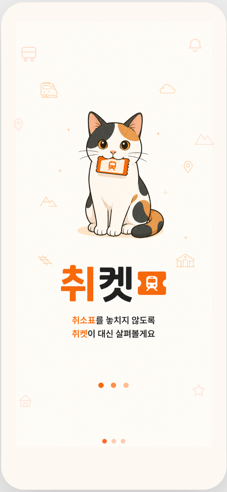
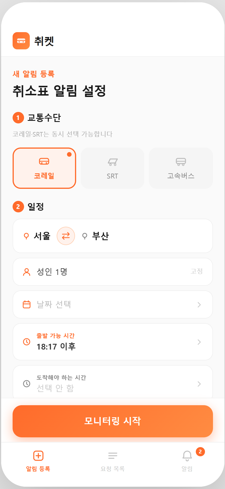
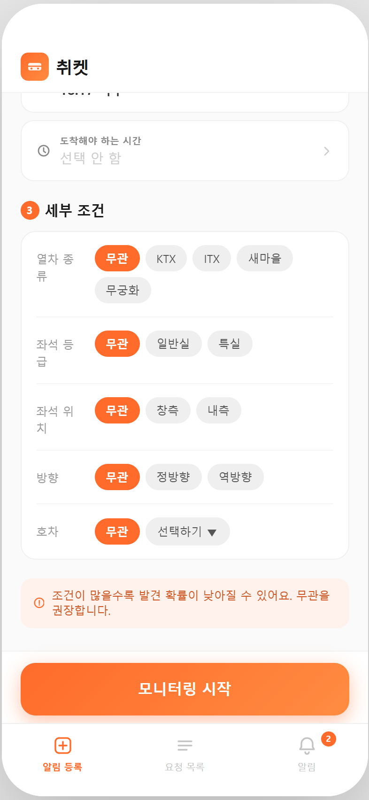
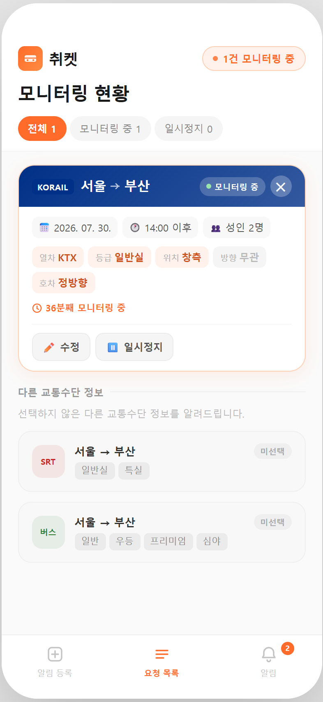
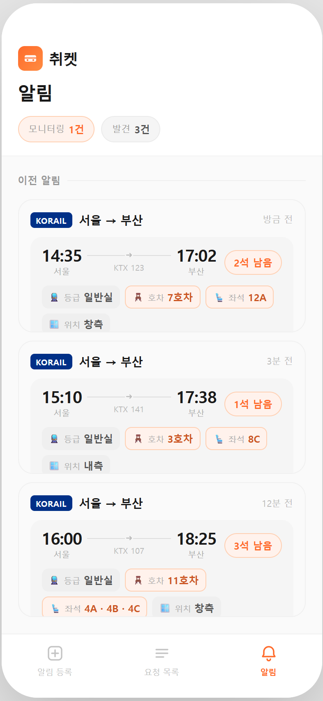

# 취켓 — 기차·고속버스 취소표 대신 잡아드립니다

> [Project A] AI 기반 UI/UX 디자인 시안 제작

| 항목 | 내용 |
|---|---|
| 분야 | AI 도구 학습 |
| 구분 | Term Project |
| 과제명 | [Project A] AI 기반 UI/UX 디자인 시안 제작 |
| 팀 구성 | 5인 |
| 제출일 | 2026.07.26. |

---

## 1. 프로젝트 개요

### 1-1. 서비스 정의

| 항목 | 내용 |
|---|---|
| 서비스명 | 취켓 (Chwiket) |
| 서비스 소개 문구 | 기차·고속버스 취소표 대신 잡아드립니다 |
| 메인 캐릭터 | 티켓을 물고 있는 고양이 |
| 한 줄 정의 | 매진된 열차·버스에 원하는 좌석 조건과 시간대를 걸어두면, 취소표가 나오는 순간 알려주고 공식 예매처로 바로 보내주는 앱 |
| 핵심 타깃 | 내일 오전 부산 미팅인데 KTX가 전부 매진돼서, 이동하면서도 10분마다 앱을 새로고침하고 있는 사회초년생 |
| 사용자가 앱을 여는 목적 | 조건을 3분 안에 걸어두고, 그 뒤로는 앱을 열지 않아도 되는 상태를 만드는 것 |
| 대상 이동수단 | 코레일 · SRT · 고속버스 |
| 핵심 차별점 | 알림만 보내는 것이 아니라 조건을 자세히 지정할 수 있다 (좌석 등급, 창측·내측, 호차, 정방향·역방향, 도착 희망 시간) |

**서비스 범위**

취켓은 취소표를 **찾아서 알려주는 것까지**를 맡는다. 실제 예매와 결제는 코레일·SRT 같은 공식 예매처에서 이루어지고, 앱은 알림과 함께 그곳으로 연결해 주는 역할을 한다.

### 1-2. 사용 도구

| 단계 | 도구명 | 유·무료 | 선택 이유 |
|---|---|---|---|
| 이미지 생성 · 후가공 | Codex CLI (GPT-5.6 Sol, 추론 강도 xhigh) | 유료 | 말로 지시하고 결과를 바로 확인해 다시 요청할 수 있어서 고치는 속도가 빨랐고, 한글이 제대로 나왔는지 그 자리에서 확인할 수 있었다 |
| 초기 시안 탐색 | Gemini (Nano Banana 2) | 유료 | 처음 방향을 잡는 단계에서 여러 화면 구성안을 빠르게 비교해 보려고 사용했다. 최종 제출 이미지에는 사용하지 않았다 |
| UI 구조 검토 | Stitch AI | 유료 | 조건 입력을 접었다 펴는 형태로 만들면 어떨지 검토하려고 사용했다. 이미지 제작에는 사용하지 않았다 |
| 스펙 문서화 | Claude Code (Opus 5) | 유료 | 작업 가이드 문서를 AI가 계속 참고할 수 있는 형태로 정리하고, 교통수단별 조건 차이를 코드 단계에서 걸러내려고 사용했다 |
| 프로토타입 구현 | Codex CLI (GPT-5.6 Sol, 추론 강도 xhigh) | 유료 | 스크롤이나 날짜 선택처럼 이미지로는 확인할 수 없는 동작을 직접 눌러보려고 React로 구현했다 |
| 배치 · 퍼블리시 | Figma | 무료 | 과제에서 권장한 도구이고, 화면을 배치하고 링크로 공유하기 편했다 |

### 1-3. 팀 역할 분담

| 구분 | 담당 | 이름 | 수행 내용 |
|---|---|---|---|
| 팀장 | 문서 작성 | 고은 | 프로젝트 진행 관리, 프롬프트 기록, 산출물 문서(README) 총괄 |
| 팀원 | 프로세스 설계 | 문정현 | 사용자 흐름 설계, 기능 우선순위(P0/P1/P2) 정리 |
| 팀원 | UX/UI 디자인 · 이미지 생성 | 배주한 · 이충관 · 안현탁 | 스타일 기준 수립, 화면 이미지 생성, 프롬프트 개선, 이미지 후가공, 프로토타입 제작 |

---

## 2. 최종 산출물

### 2-1. UI 디자인 이미지

총 5장을 만들었고, 하는 일을 기준으로 보면 **진입 / 입력 / 관리 / 결과** 네 가지로 나뉜다.
(화면 2와 화면 3은 같은 '알림 등록' 화면의 위쪽과 아래쪽으로, 긴 입력 폼의 서로 다른 부분을 보여준다.)

> **이름 표기에 대해.** 이 문서에서 화면 이름은 **화면 맨 위에 있는 제목**을 따랐다. 하단 메뉴의 이름은 화면 제목과 다르기 때문에, 메뉴를 가리킬 때는 화면에 적힌 그대로(`알림 등록` · `요청 목록` · `알림`) 썼다.
>
> | 화면 제목 (문서에서 쓰는 이름) | 하단 메뉴 이름 |
> |---|---|
> | 알림 등록 | `알림 등록` |
> | 모니터링 현황 | `요청 목록` |
> | 알림 | `알림` |

이미지 5장의 공통 사양은 다음과 같다.

| 항목 | 내용 |
|---|---|
| 화면 비율 | 모바일 세로 (393 × 852 화면 기준) |
| 파일 형식 | PNG |
| 생성 도구 | Codex CLI (GPT-5.6 Sol, 추론 강도 xhigh) |

#### 화면 1. 진입 (스플래시)



**화면 역할** 진입. 앱을 켰을 때 어떤 서비스인지 한눈에 알린다

**파일명** `01_splash.png`

**포함 요소**

- 고양이 캐릭터
- 로고 "취켓"
- 서비스 문구 "취소표를 놓치지 않도록 취켓이 대신 살펴볼게요"
- 로딩 인디케이터
- 배경 아이콘 (열차 · 버스 · 알림)

#### 화면 2. 알림 등록 (교통수단 · 일정)



**화면 역할** 입력. 어디서 어디로, 언제, 몇 명이 가는지 등록한다

**파일명** `02_register_basic.png`

**포함 요소**

- ① 교통수단 선택 (코레일 / SRT / 고속버스)
- ② 일정 입력 (출발지 · 도착지 · 바꾸기 버튼, 인원, 날짜, 출발 가능 시간, 도착해야 하는 시간)
- "모니터링 시작" 버튼
- 하단 메뉴 3개 (`알림 등록` 선택 상태)

알림 등록은 세로로 긴 하나의 입력 화면이며, 입력 항목을 ① 교통수단 → ② 일정 → ③ 세부 조건 세 단계로 나누어 번호를 붙였다. 화면 2는 그중 ①과 ②가 보이는 위쪽 부분이고, 이어지는 ③은 화면 3에서 확인할 수 있다.

#### 화면 3. 알림 등록 (세부 조건)



**화면 역할** 입력. 좌석 조건을 자세히 고른다. 이 서비스의 차별점이 드러나는 부분이다

**파일명** `03_register_condition.png`

**포함 요소**

- ③ 세부 조건 (열차 종류 · 좌석 등급 · 좌석 위치 · 방향 · 호차)
- 조건별 선택 버튼
- 안내 문구 "조건이 많을수록 발견 확률이 낮아질 수 있어요"
- "모니터링 시작" 버튼
- 하단 메뉴 3개 (`알림 등록` 선택 상태)

화면 2에서 아래로 스크롤한 부분으로, 마지막 단계인 ③ 세부 조건이 보인다.

#### 화면 4. 모니터링 현황



**화면 역할** 관리. 걸어둔 요청이 지금 어떤 상태인지 확인한다

**파일명** `04_monitoring.png`

**포함 요소**

- 상단 요약 "2건 모니터링 중"
- 상태 필터 (전체 / 모니터링 중 / 일시정지)
- 요청 카드 (사업자 · 경로 · 날짜 · 시간 · 인원 · 조건 요약 · 상태 · 삭제)
- "다른 교통수단 정보" (선택하지 않은 SRT · 고속버스 안내)
- 하단 메뉴 3개 (`요청 목록` 선택 상태)

#### 화면 5. 알림



**화면 역할** 결과. 찾아낸 취소표를 확인한다

**파일명** `05_notification.png`

**포함 요소**

- 요약 필터 (모니터링 2건 / 발견 3건)
- 알림 카드 (사업자 · 경로 · 출발·도착 시각 · 열차번호)
- 남은 좌석 수
- 좌석 정보 (등급 · 호차 · 좌석번호 · 창측 여부)
- 알림 받은 시각
- 하단 메뉴 3개 (`알림` 선택 상태)

### 2-2. Figma 프로토타입

- **프로토타입 링크:** https://silo-lever-89024053.figma.site/
- **접근 권한:** 링크가 있는 누구나 열람 가능 (로그아웃 상태에서 열리는 것을 확인했다)
- **화면 크기:** 393 × 852 (모바일 세로)

프로토타입은 Figma Sites로 퍼블리시했다. 이미지를 이어 붙인 것이 아니라 실제로 스크롤하고 입력하고 화면을 넘길 수 있는 형태라, 위 링크에서 바로 눌러볼 수 있다.

**화면 흐름**

```
01_진입
   │
   ▼
02_알림 등록(교통수단·일정) ──[ 스크롤 ]──▶ 03_알림 등록(세부 조건)
                                                │
                                       [ "모니터링 시작" ]
                                                ▼
                                          04_모니터링 현황
                                                │
                                       [ 하단 메뉴 `알림` ]
                                                ▼
                                            05_알림
```

**화면 연결 목록**

| 연결 | 출발 화면 · 누르는 곳 | 도착 화면 | 동작 |
|---|---|---|---|
| 1 | 01_진입 · 화면 전체 | 02_알림 등록 (교통수단·일정) | 클릭 시 이동 |
| 2 | 03_알림 등록 (세부 조건) · "모니터링 시작" 버튼 | 04_모니터링 현황 | 클릭 시 이동 |
| 3 | 04_모니터링 현황 · 하단 메뉴 `알림` | 05_알림 | 클릭 시 이동 |

### 2-3. 요구사항 충족 요약

| 미션지 요구사항 | 충족 | 확인 위치 |
|---|---|---|
| UI 이미지 3장 이상 | ☑ | 2-1 |
| 화면 역할이 구분되는 구성 | ☑ | 2-1 |
| 모바일 9:16 또는 데스크탑 16:9 준수 | ☑ | 2-1 |
| 파일 형식 PNG 또는 JPG | ☑ | 2-1 |
| 이미지 내 텍스트 깨짐·부자연스러운 요소 수정 | ☑ | 4-3 |
| 이미지 생성 AI 도구 1개 이상 사용 | ☑ | 1-2 |
| 프롬프트 초안 → 수정 → 최종 기록 | ☑ | 4-1 |
| 각 수정 단계의 변경 이유와 결과 차이 기록 | ☑ | 4-1 |
| Figma 등으로 이미지 배치 | ☑ | 2-2 |
| 클릭 가능 영역(Hotspot) 또는 화면 전환 표시 | ☑ | 2-2 |
| 사용한 툴 이름 명시 | ☑ | 1-2 |
| 레퍼런스 출처 기록 | ☑ | 부록 A |

---

## 3. 설계 근거

### 3-1. 전체 흐름 중 이 화면들을 고른 이유

서비스의 전체 사용자 흐름은 여덟 단계다.

```
앱 진입 → 교통수단 선택 → 기본 일정 입력 → 교통수단별 세부 조건 입력
→ 희망 시간 범위 설정 → 입력 조건 확인 → 모니터링 요청 생성
→ 요청 목록 상태 확인 → 취소표 발생 알림 → 사용자 행동 선택
```

이 중에서 **서비스가 성립하는 데 꼭 필요한 최소한의 화면**을 골랐다. `걸어둔다 → 지켜본다 → 잡는다`, 이 세 박자가 없으면 나머지 화면은 의미가 없다고 봤다.

| 화면 | 흐름상 위치 | 이 화면이 보여주는 것 |
|---|---|---|
| 진입 | 앱 진입 | 무엇을 해주는 앱인지 **한 문장으로 알린다** |
| 알림 등록 (교통수단·일정) | 교통수단 선택 · 기본 일정 입력 | 조건을 **걸어둘 수 있다** |
| 알림 등록 (세부 조건) | 교통수단별 세부 조건 · 희망 시간 범위 | 조건이 **자세하다** (차별점) |
| 모니터링 현황 | 요청 목록 상태 확인 | 걸어둔 것을 **지켜보고 있다** |
| 알림 | 취소표 발생 알림 | 결국 **찾아준다** |

**입력 화면을 두 장으로 나눈 이유**
알림 등록은 교통수단, 일정, 세부 조건, 시간 범위까지 이어지는 긴 입력 폼이다. 한 화면에 다 담으면 요소가 스무 개를 넘어가서 읽기 어렵고, 이미지로 만들 때도 결과가 눈에 띄게 나빠졌다. 그래서 번호(①②③)로 구간을 나누고 세로로 스크롤하는 구조로 만들어, 한 번에 한 부분씩 입력하도록 했다.

**세부 조건 화면을 따로 보여준 이유**
좌석 등급, 창측·내측, 호차, 정방향·역방향은 기존 취소표 알림 서비스와 우리 서비스가 갈리는 지점이다. 이 화면이 없으면 "그냥 알림 앱"과 구분되지 않는다고 판단해서, 조건 선택 화면 전체가 보이도록 따로 담았다.

### 3-2. 기능 우선순위

| 우선순위 | 항목 |
|---|---|
| **P0** 필수 구현 | 이동수단 선택, 출발지·도착지 선택, 날짜·인원 선택, 차량·좌석 조건 선택, 시간 범위 설정, 모니터링 요청 생성, 요청 목록 출력, 요청 수정·삭제·일시정지, 취소표 발견 알림, 반응형 모바일 UI |
| **P1** 선택 구현 | 노선 즐겨찾기, 입력값 로컬 저장, 공식 예매처 이동 |
| **P2** 구현 범위 제외 | 실제 코레일·SRT 로그인, 실시간 좌석 조회, 실제 예매·결제, 회원가입, 지도, 서버 및 데이터베이스, 실제 푸시 알림 |

P2를 따로 정리해 둔 이유는 **화면에 그리지 않기 위해서**다. 이미지 생성 AI는 "예매 앱"이라고만 하면 로그인 화면이나 지도, 결제 카드 같은 것을 알아서 끼워 넣는다. 그래서 프롬프트에 아예 "넣지 말 것"으로 적어두었다.

### 3-3. 상태 표현 설계

요청 상태는 다섯 가지(`모니터링 중` `취소표 발견` `확인 중` `일시정지` `종료`)지만, 다섯 가지를 각각 다른 색으로 만들지는 않았다.

| 상태 묶음 | 상태 | 색 처리 |
|---|---|---|
| 진행 중 | 모니터링 중, 확인 중 | 주황 + 상태 점 표시 |
| **발견** | **취소표 발견 / 남은 좌석** | 주황으로 강조 (좌석 수와 좌석 정보에 집중해서 사용) |
| 멈춤 | 일시정지 | 회색 |
| 종료 | 종료 | 옅은 회색 |

이 앱에서 사용자가 알고 싶은 것은 **"내 요청이 잡혔나?"** 하나다. 색이 다섯 개로 흩어지면 정작 중요한 그 하나가 묻히기 때문에, 강조색은 주황 하나로 제한하고 나머지는 회색 계열로 눌렀다.

**시안에는 이 중 세 가지(`모니터링 중`, `취소표 발견`, `일시정지`)만 그렸다.** `확인 중`은 시스템이 잠깐 거치는 중간 상태라 사용자가 볼 일이 드물고, `종료`는 이미 끝난 요청이라 흐름을 보여주는 데 필요하지 않다고 판단했다.

**보조색을 하나 더 쓴 이유**
사업자 표시(KORAIL)에는 남색을 썼다. 화면 전체가 주황 하나로만 되어 있으면 브랜드 느낌은 살지만 정보가 잘 구분되지 않는데, 어느 회사 열차인지는 사용자가 가장 먼저 알아야 하는 정보라 색을 따로 줬다.

**선택하지 않은 항목은 흐리게 처리했다**
모니터링 현황 화면의 "다른 교통수단 정보"에서 SRT와 버스는 회색으로 처리했다. 지금 걸어둔 조건과 걸지 않은 조건이 색만 봐도 바로 갈리도록 하기 위해서다.

---

## 4. 작업 로그

> 미션지 필수 산출물 ② : 프롬프트 기록 / 초안 → 수정 → 최종 / 각 수정의 이유와 결과 차이
>
> 이 장의 내용은 별도 제출 파일 [`취켓_작업로그.md`](./취켓_작업로그.md) 와 같다.

### 4-1. 화면별 프롬프트 변천

#### 화면 1. 진입 (스플래시)

| 단계 | 프롬프트 | 변경 이유 | 결과 및 개선점 |
|---|---|---|---|
| 초안 | (없음) | 처음 정리한 8개 화면에 진입 화면이 없어서, 초안 단계 없이 바로 만들었다 | — |
| 최종 | 취켓 로딩 화면. 티켓을 문 고양이 마스코트를 상단 중앙에, 그 아래 앱 이름 '취켓', 문구 "취소표를 놓치지 않도록 / 취켓이 대신 살펴볼게요", 하단에 주황 3점 로딩 인디케이터. 크림색 배경 #FFFBF5, 버튼·하단탭·로그인 없음 | 캐릭터를 보여줄 화면이 없어서, 앱을 켰을 때 나오는 첫 화면을 새로 만들어 캐릭터와 서비스 설명을 한 번에 전달하려고 했다 | 캐릭터, 앱 이름, 문구가 한 화면에 정리됐다. 버튼류를 "넣지 말 것"에 넣어둔 덕분에 첫 화면에 불필요한 버튼이 생기지 않았다 |

#### 화면 2·3. 알림 등록 (교통수단·일정 / 세부 조건)

| 단계 | 프롬프트 | 변경 이유 | 결과 및 개선점 |
|---|---|---|---|
| 초안 | 취소표 모니터링 앱 화면 4개를 한 장에 보여주는 보드로 만들어줘. 수단 선택 → 일정 입력 → 세부 조건 → 조건 확인. 파란색 #2563EB, 390×844 | 화면을 하나씩 다듬기 전에, 입력 흐름 전체가 어떤 모습으로 나오는지 한 장에 모아 방향부터 확인하려 했다 | 한글은 제대로 나왔지만 네 화면이 한 장에 들어가다 보니 화면 하나당 크기가 너무 작아졌다. 요청하지도 않은 설정(⚙) 아이콘이 위쪽에 생겼고, 입력이 4단계로 쪼개져 화면 수가 늘어났다 |
| 수정 1 | 이미지는 각각 생성해야 해. 한 화면에 하나씩. 앱 이름은 취켓, 적용색은 주황색, 마스코트는 티켓 물고 있는 고양이 | 보드 형태로는 화면 하나당 크기가 제출 기준(세로 한 장)에 못 미쳤고, 앱 이름과 색, 캐릭터가 정해지지 않아 만들 때마다 분위기가 달라졌다 | 853×1844 한 장짜리로 크기를 확보했다. 밋밋하던 느낌이 친근한 쪽으로 바뀌었다. 다만 조건의 기본값을 정해주지 않아서 KTX, 일반실처럼 첫 번째 항목이 임의로 선택된 채로 나왔다. 캐릭터 색을 지정하지 않아 삼색 고양이로 나왔다 |
| 수정 2 | 모든 화면이 한 페이지에서 자동으로 나오도록 다음 버튼 없애고, 무관 버튼이 기본 디폴트에 옵션 가장 첫 번째 순서에 자리하게 | 급한 사람에게 4단계나 화면을 넘기게 하는 건 번거롭고, 조건을 따로 정하지 않는 것도 정상적인 사용인데 '무관'이 뒤에 있으면 굳이 골라야 할 것 같은 부담이 생긴다 | 4단계로 나뉘어 있던 입력이 세로로 스크롤하는 한 화면으로 합쳐지고 '다음' 버튼이 사라졌다. 모든 조건 줄에서 '무관'이 첫 번째이자 기본 선택 상태가 됐다. 다만 아래 고정 버튼과 스크롤 영역의 경계가 애매하게 표현됐다 |
| 최종 | (스타일 문장 고정) 390×844 세로 화면, 주황 #F97316, 좌우 여백 20px, 버튼 높이 48px, 하단 탭 3개, 모든 조건 행은 '무관'이 첫 옵션이자 선택 상태. (금지) 설정 아이콘·로그인·지도·결제·광고·좌석 배치도·파란색·다음 버튼·구 앱명 '자리났다' 사용 금지 | 앞선 수정에서, 우리가 지정하지 않은 부분은 AI가 흔한 앱 형태로 알아서 채워 넣는다는 걸 확인했다. 그래서 넣을 것뿐 아니라 넣지 말 것도 함께 적었다 | 설정 아이콘, 파란색, 다음 버튼이 다시 나오지 않았다. 하단 메뉴는 3개로 유지됐고 한글에도 오탈자가 없었다. 이 스타일 문장을 그대로 복사해 다른 화면에도 쓰면서 색, 여백, 버튼 높이가 서로 맞았다 |

#### 화면 4. 모니터링 현황

| 단계 | 프롬프트 | 변경 이유 | 결과 및 개선점 |
|---|---|---|---|
| 초안 | 요청 목록 화면. 모니터링 중인 요청 카드를 나열하고 상태 칩과 수정·일시정지·삭제 버튼 배치 | 걸어둔 요청을 확인하고 관리하는 화면이므로, 카드 목록과 상태 표시, 관리 버튼이라는 기본 구조부터 잡아보려 했다 | 내가 고른 교통수단만 보여서, 다른 수단으로 바꿔 탈 수 있는지 판단할 정보가 화면에 없었다 |
| 최종 | 사용자가 선택한 코레일 요청을 먼저 주황 강조로 표시하고, 그 아래 '다른 교통수단 정보' 섹션에 선택하지 않은 SRT·고속버스를 회색 음영 카드로 배치. 미선택 라벨 표기. 고속버스 카드에는 호차·방향을 넣지 말 것 | 고르지 않은 수단의 정보도 있어야 대안을 판단할 수 있지만, 지금 걸어둔 것과 헷갈리면 안 되니 눈에 띄는 정도를 다르게 했다 | 지금 걸어둔 요청과 참고용 정보가 확실히 구분됐다. 고속버스에 호차와 방향이 나오지 않아, 교통수단마다 다른 조건이 정확히 반영됐다 |

#### 화면 5. 알림

| 단계 | 프롬프트 | 변경 이유 | 결과 및 개선점 |
|---|---|---|---|
| 초안 | 알림 목록 화면. 취소표 발견 알림 카드를 시간순으로 나열 | 알림이 계속 쌓이는 화면이므로, 최신 알림이 위로 오는 시간순 목록이라는 가장 단순한 형태부터 확인하려 했다 | 알림 내용이 걸어둔 조건과 상관없이 만들어져서, 어떤 요청의 결과인지 알 수 없었다 |
| 최종 | 모니터링 조건을 반영한 알림 카드. 출발·도착 시각, 열차번호, 잔여 좌석 수, 좌석 등급·호차·좌석번호·창측 여부를 태그로 분리 표기. 미확인 알림 강조 | 알림이 조건과 이어지지 않으면 이 서비스의 핵심이 전달되지 않고, 좌석 정보가 한 줄로 붙어 있으면 읽기 어렵기 때문이다 | 어떤 조건으로 걸어둔 요청의 결과인지 바로 알 수 있게 됐다. 좌석 정보가 네 개 태그로 나뉘고 호차와 좌석번호가 주황으로 강조됐다 |

### 4-2. 일관성 확보 방법

| 방법 | 사용 여부 | 구체적 적용 내용 |
|---|---|---|
| 스타일 문장 고정 | ☑ | 모든 화면 프롬프트 앞에 같은 스타일 문장을 그대로 복사해서 붙였다 |
| 이미지 레퍼런스 | ☑ | 먼저 만든 결과를 확인한 뒤, 같은 분위기와 구조를 문장으로 다시 지시해서 만들었다 |
| 시드 고정 | ☐ | 사용한 도구가 시드 지정을 지원하지 않아, 스타일 문장 고정과 금지 목록으로 대신했다 |

**공통으로 사용한 스타일 문장**

```
한국어 모바일 앱 UI, 390x844 세로 화면, 정면 뷰.
플랫 디자인, 그라데이션·그림자 없음.
주황 #F97316, 선택 배경 #FFF7ED, 배경 #F8FAFC, 흰색 카드,
글자 #111827 / 보조 #6B7280, 테두리 #E5E7EB.
좌우 여백 20px, 버튼 높이 48px 라운드 12px, 입력창 라운드 10px, 상태칩 알약형.
Pretendard 계열 한국어 폰트, 한글은 정확한 철자로 판독 가능하게.
휴대폰 하드웨어 프레임·원근 기울기·프레젠테이션 보드 없음. 이모지 없음.
```

**공통으로 넣은 금지 목록**

```
설정 아이콘 · 로그인 · 지도 · 결제 · 광고 · 좌석 배치도 · 파란색 · 다음 버튼 · 구 앱명 '자리났다'
```

**모든 화면에서 지킨 시각 요소**

1. 주황(#F97316)은 선택 상태와 주요 버튼에만 쓰고, 나머지는 회색 계열로 유지
2. 하단 메뉴 3개 (`알림 등록` · `요청 목록` · `알림`)
3. 좌우 여백 20px
4. 주요 버튼 높이 48px, 모서리 12px
5. 상태 표시는 알약 모양, 카드 모서리는 8px 이하

**일관성이 깨졌던 지점과 해결 방법**

처음 만들었을 때는 화면마다 하단 메뉴 개수와 위쪽 아이콘 구성이 달랐다. 프롬프트에 "무엇을 넣을지"만 적고 "무엇을 넣지 말지"는 적지 않아서, AI가 흔한 앱 형태(설정 아이콘, 메뉴 5개 등)로 빈자리를 채웠기 때문이다. 스타일 문장 뒤에 **공통 금지 목록**을 붙여 다시 만든 뒤로는 같은 문제가 다시 나오지 않았다.

### 4-3. 이미지 후가공

| 화면 | 문제 위치 | 문제 유형 | 사용한 기법 | 수정 후 |
|---|---|---|---|---|
| 알림 등록 | 상단 헤더 | 요청하지 않은 요소가 들어감 (설정 ⚙ 아이콘) | 프롬프트에 금지 항목을 적고 다시 생성 | 설정 아이콘을 없애고, 캐릭터와 앱 이름 '취켓'으로 교체 |
| 알림 등록 | 조건 선택 영역 | 기본값이 엉뚱하게 선택됨 (첫 항목이 임의로 선택) | 프롬프트에 기본값을 적고 다시 생성 | 모든 조건 줄에서 '무관'이 첫 번째이자 선택된 상태로 통일 |
| 모니터링 현황 | 고속버스 카드 | 있으면 안 되는 항목이 표시됨 (호차·방향) | 프롬프트에 제외 항목을 적고 다시 생성 | 고속버스에는 버스 등급과 좌석 위치만 표시 |

**인페인팅이나 업스케일링 대신 프롬프트를 고쳐 다시 만든 이유**

문제가 대부분 **글자가 뭉개진 것처럼 이미지 한 부분만 잘못된 경우가 아니라, 지시를 빠뜨려서 화면 구성 자체가 잘못 나온 경우**였다. 이런 문제는 그 부분만 덮어써도 다음에 만들 때 똑같이 반복된다. 반면 프롬프트를 고치면 이후 화면에도 그대로 적용되기 때문에, 문제를 두 종류로 나눠서 후자에는 다시 만드는 방식을 썼다.

**프로토타입 단계에서 추가로 고친 것**

이미지만 봐서는 몰랐고 실제로 눌러봐야 드러나는 문제들을 네 차례에 걸쳐 고쳤다.

| 회차 | 증상 | 조치 |
|---|---|---|
| 1차 | 세부 조건까지 스크롤이 안 돼서 선택할 수 없었다 | 레이아웃을 바꾸고, 스크롤 영역과 아래 고정 버튼을 분리했다 |
| 1차 | 알림 화면이 걸어둔 조건과 상관없는 내용을 보여줬다 | 조건에 맞는 알림 카드로 다시 만들고, 아직 확인하지 않은 알림을 강조했다 |
| 2차 | 날짜·시간 설정이 동작하지 않았다 | 달력 팝업(월 이동, 지난 날짜 비활성)과 시·분 선택기를 만들었다 |
| 2차 | 호차 18개가 한꺼번에 나와 화면을 다 차지했다 | '무관'과 '선택하기' 버튼만 두고, 누르면 옆으로 넘겨보게 했다 |
| 2차 | 출발지·도착지가 도시 이름으로만 나왔다 | 실제 역 이름을 넣었다 (수서, 동탄, 평택지제, 광주송정, 천안아산 등) |
| 3차 | 호차를 옆으로 넘길 때 끝까지 가지 않았다 | 마우스로 끌 수 있게 하고, 양쪽 끝을 흐리게 처리해 더 넘길 수 있다는 걸 알렸다 |
| 4차 | 알림 카드의 시각 글자가 잘렸다 | 글자 크기를 줄이고, 가운데 영역과 좌석 수 표시의 폭 처리를 분리했다 |
| 4차 | 좌석 정보가 한 줄로만 표시됐다 | 등급·호차·좌석번호·창측을 네 개 태그로 나누고, 호차와 좌석번호를 주황으로 강조했다 |

---

## 5. 학습 목표 자가 점검

### 5-1. 프롬프트 구성 요소가 결과물에 미치는 영향

프롬프트에 무엇을 적느냐에 따라 결과가 완전히 달라졌다. 처음에는 화면 네 개를 한 장에 넣어 달라고만 했더니, 화면 하나하나가 너무 작게 나와서 제출 기준을 맞출 수 없었다. 여기서 "무엇을 그릴지"뿐 아니라 **"어떤 크기와 형태로 그릴지"까지 적어야 한다**는 걸 알게 됐다.

색도 마찬가지였다. "파란색" 정도로만 적었을 때는 화면마다 톤이 달랐는데, `#F97316`처럼 정확한 값으로 적으니 편차가 크게 줄었다. 여백 20px, 버튼 높이 48px처럼 숫자로 적은 부분은 여러 화면에 걸쳐 거의 그대로 지켜졌다.

가장 뜻밖이었던 건 **"넣지 말 것"을 적는 일의 효과**였다. 우리가 지정하지 않은 자리는 비어 있는 게 아니라, AI가 흔한 앱 형태로 알아서 채웠다. 요청한 적 없는 설정 아이콘이 계속 생겼고 하단 메뉴가 다섯 개로 나오기도 했다. 금지 목록을 프롬프트에 붙인 뒤로는 이런 일이 다시 생기지 않았다. 프롬프트는 원하는 걸 나열하는 작업인 동시에 **원하지 않는 걸 막는 작업**이기도 하다는 것이 이번에 얻은 가장 큰 배움이다.

### 5-2. AI 생성 이미지의 문제점 식별과 수정 방법

문제는 크게 두 종류였다. 하나는 글자가 뭉개지는 것처럼 이미지의 한 부분만 잘못된 경우고, 다른 하나는 우리가 지시를 빠뜨려서 화면 구성 자체가 잘못 나온 경우다. 후자가 훨씬 많았다. 요청하지 않은 설정 아이콘이 들어가거나, 조건의 기본값이 엉뚱하게 선택되거나, 고속버스인데 호차가 표시되는 식이었다.

문제를 찾을 때는 **화면을 나란히 놓고 비교하는 방법**이 가장 효과적이었다. 한 장만 볼 때는 자연스러워 보이던 여백이나 버튼 크기도, 여러 장을 붙여 놓으면 차이가 바로 보였다.

고칠 때는 두 종류를 다르게 다뤘다. 이미지 한 부분만 잘못된 경우라면 그 부분만 덮어쓰는 게 빠르지만, 지시를 빠뜨려서 생긴 문제는 그렇게 고쳐봐야 다음에 만들 때 똑같이 반복된다. 그래서 이번에는 프롬프트를 고쳐서 다시 만드는 방식을 주로 썼고, 그 결과 한 번 고친 내용이 이후 화면에도 그대로 적용됐다.

### 5-3. AI 생성 이미지의 일관성 유지 방법

여러 장의 이미지를 같은 분위기로 맞추는 방법으로는 보통 세 가지가 쓰인다. **시드 고정**은 생성할 때의 무작위 값을 똑같이 유지해서 비슷한 결과를 얻는 방법이고, **이미지 레퍼런스**는 기준이 되는 이미지를 같이 주면서 그 스타일을 따르게 하는 방법이며, **스타일 문장 고정**은 같은 스타일 지시문을 모든 프롬프트에 반복해서 넣는 방법이다.

우리가 쓴 도구는 시드 지정을 지원하지 않아서 나머지 두 가지를 함께 썼다. 색, 여백, 버튼 크기, 글꼴을 정해둔 스타일 문장을 만들어 모든 프롬프트 앞에 그대로 복사해서 붙였고, 첫 화면이 나온 뒤에는 그 결과를 기준으로 삼아 다음 화면을 만들었다.

처음에는 화면마다 하단 메뉴 개수와 위쪽 아이콘이 달랐다. 스타일 문장에 더해 금지 목록까지 붙여 다시 만든 뒤로는 문제가 사라졌다. 이번 경험으로 보면 **여러 화면을 만들 때는 한 장을 먼저 확정하고 그것을 기준으로 삼는 것**이 가장 확실한 방법이었다.

### 5-4. 기획 → 이미지 생성 → 후가공 → 프로토타입 워크플로우

이번 작업은 네 단계로 진행됐다.

**① 기획** 단계에서는 서비스가 무엇인지 정하고 전체 사용자 흐름을 그린 뒤, 기능을 P0·P1·P2로 나눴다. 여기서 정한 "만들지 않을 것"(P2)이 나중에 프롬프트의 금지 목록으로 그대로 이어졌다는 점이 중요하다. 이 단계는 어떤 화면을 몇 장 만들지, 각 화면에 무엇이 들어가는지가 정해졌을 때 마무리했다.

**② 이미지 생성** 단계에서는 간단한 프롬프트로 방향을 확인한 뒤, 화면 종류·크기·색·금지 항목을 하나씩 추가하며 고쳐 나갔다. 이 단계는 "완벽한 이미지가 나올 때까지"가 아니라 **"뒤에서 다듬을 수 있는 수준이 되면"** 끝냈다.

**③ 후가공** 단계에서는 잘못 들어간 요소를 걷어내고, 정렬과 색을 맞췄다. 이 단계를 거치고 나서야 화면들이 하나의 서비스처럼 보였다.

**④ 프로토타입** 단계에서는 화면을 순서대로 연결해 실제로 눌러볼 수 있게 만들었다. 여기서 이미지만 봐서는 몰랐던 문제들이 드러났다. 스크롤이 안 되거나, 날짜 선택이 동작하지 않거나, 호차 18개가 화면을 다 차지하는 문제들이었다.

이 흐름에서 얻은 가장 큰 교훈은 **앞 단계가 뒤 단계의 부담을 결정한다**는 점이다. 기획에서 화면 구성을 분명히 할수록 이미지를 만들 때 시행착오가 줄었고, 이미지 단계에서 요소를 덜어낼수록 후가공이 빨랐다.

한 가지 아쉬운 점도 있었다. 이미지를 만들면서 앱 이름과 색, 입력 구조를 바꿨는데, 앞서 작성해 둔 스펙 문서에는 그 변경이 반영되지 않아 문서와 실제 화면이 어긋난 구간이 생겼다. 다음에는 시안이 확정될 때마다 문서도 함께 고쳐야겠다.

---

## 부록 A. 레퍼런스 출처

| 참고 대상 | 출처 | 참고 방식 |
|---|---|---|
| 취소표 알리미 (기존 서비스) | https://play.google.com/store/apps/details?id=com.express_bus_ticket_noti&hl=ko | 취소표가 나오면 알림을 보내는 기능 개념과 정보 구성을 참고했다. 화면을 캡처하지 않았고 UI는 직접 새로 만들었다 |

## 부록 B. 저작권 및 윤리 준수 확인

- 저작권 문제가 해결된 AI 도구만 사용했으며, 사용한 도구명을 1-2에 적었다
- Figma 외의 도구를 사용한 경우 그 이유를 함께 적었다
- 참고한 서비스의 출처를 부록 A에 기록했다
- 핀터레스트, Dribbble 등에서 다른 사람의 작업물을 캡처해 사용하지 않았다
- 코레일톡, SRT 등 실제 서비스 앱의 화면을 캡처해 사용하지 않았다
- AI가 만든 이미지에서 잘못 들어간 요소를 고친 뒤에 제출했다
- 팀원 이름은 역할을 표시하려는 목적으로만 썼고, 연락처 같은 다른 개인정보는 넣지 않았다
